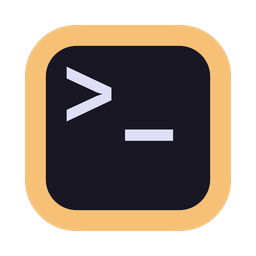

<p align="center">
    
</p>

<h1 align="center">Piyo</h1>

<p align="center">Der gemütlichste Terminal-Emulator 🐥</p>

<p align="center">
    <a href="README.md">English</a> | Deutsch | <a href="README.ja.md">日本語</a> | <a href="README.zh.md">简体中文</a>
</p>


## Funktionen

- ⚡ GPU-beschleunigtes Rendering
- 👻 Ghostty-basierte Terminal-Engine
- 🍎 Natives macOS-Erscheinungsbild
- 🌐 Mehrsprachige Unterstützung
- ✨ Claude-Code- und Codex-CLI-Integration
- 🐚 Bash-, Zsh-, Fish- und Nushell-Integration
- 🎨 Shiki-basierte Themes
- ⚙️ TOML-basierte Benutzerkonfiguration

## Installation

### Homebrew

```sh
brew install --cask sotasan/tap/piyo
```

### Manuell

Lade die neueste Version von der [Releases-Seite](https://github.com/sotasan/piyo/releases/latest) herunter.

## Lizenz

[MIT](LICENSE)
