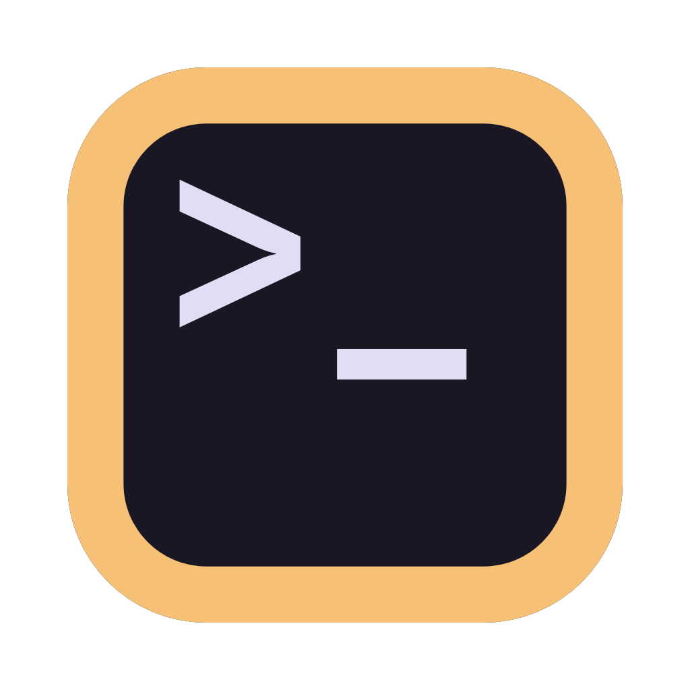

<p align="center">
    
</p>

<h1 align="center">Piyo</h1>

<p align="center">The coziest terminal emulator 🐥</p>

<p align="center">
    English | <a href="README.de.md">Deutsch</a> | <a href="README.fr.md">Français</a> | <a href="README.ja.md">日本語</a> | <a href="README.zh.md">简体中文</a>
</p>

> [!WARNING]
> **This is an early, in-development version of Piyo, rebuilt from scratch in
> SwiftUI and Rust.** It's not the released app, and it changes constantly. For
> a stable build, see [Installation](#installation).


## Features

- ⚡ GPU-accelerated rendering
- 👻 Ghostty-powered terminal engine
- 🖼️ Kitty graphics and keyboard protocols
- 🔤 Full Unicode and emoji support
- ✒️ Font ligature support
- 🍎 Native macOS look and feel
- 🗂️ Tabbed terminal sessions
- ✨ Claude Code and Codex CLI integration
- 🐚 Bash, Zsh, Fish and Nushell integration
- 🌐 Multi-language support
- 🎨 Shiki-powered themes
- ⚙️ TOML-based user config

## Installation

### Homebrew

```sh
brew install --cask sotasan/tap/piyo
```

### Manual

Download the latest release from the [releases page](https://github.com/sotasan/piyo/releases/latest).

## Development

```sh
git clone --recursive https://github.com/sotasan/piyo.git
cd piyo
mise install
mise run setup
xcodegen generate
```

## License

[MIT](LICENSE)
